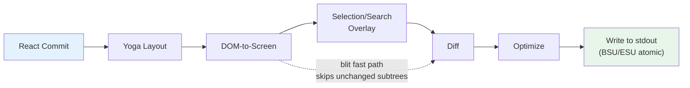
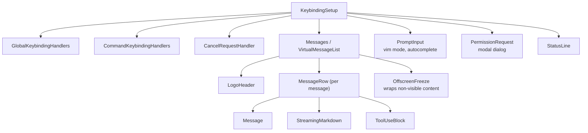
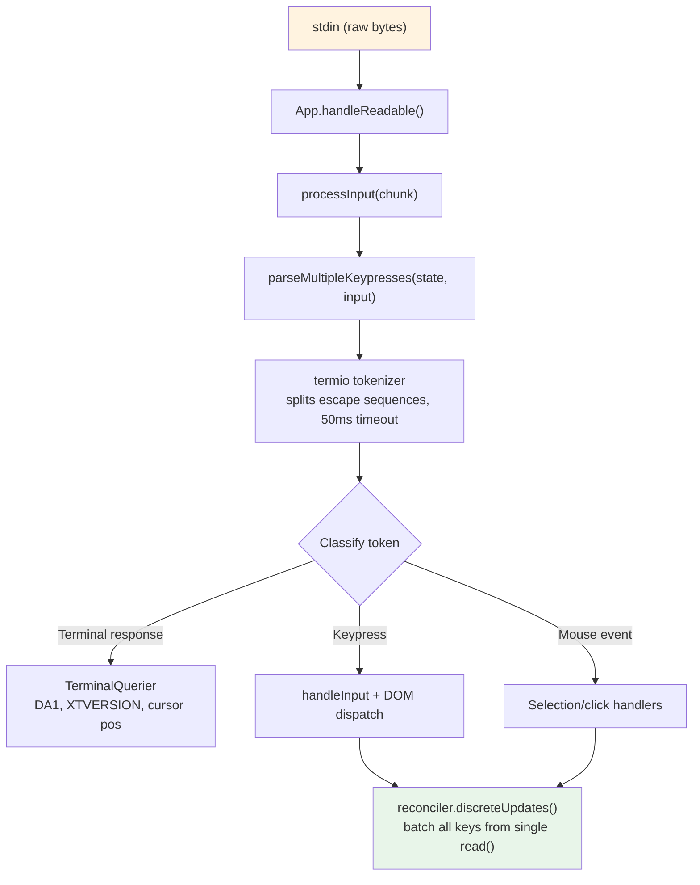
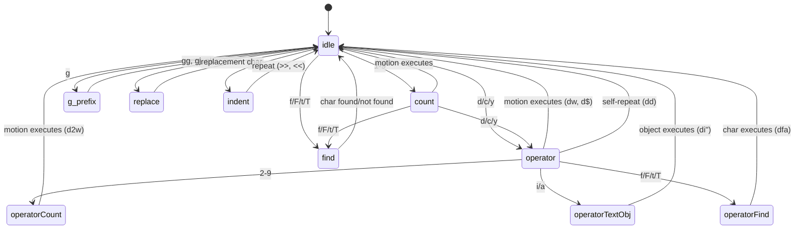

# Chapter 13: The Terminal UI

## Why Build a Custom Renderer?

The terminal is not a browser. There is no DOM, no CSS engine, no compositor, no retained-mode graphics pipeline. There is a stream of bytes going to stdout and a stream of bytes coming from stdin. Everything between those two streams -- layout, styling, diffing, hit-testing, scrolling, selection -- has to be invented from scratch.

Claude Code needs a reactive UI. It has a prompt input, streaming markdown output, permission dialogs, progress spinners, scrollable message lists, search highlighting, and a vim-mode editor. React is the obvious choice for declaring this kind of component tree. But React needs a host environment to render into, and terminals do not provide one.

Ink is the standard answer: a React renderer for terminals, built on Yoga for flexbox layout. Claude Code started with Ink, then forked it beyond recognition. The stock version allocates one JavaScript object per cell per frame -- on a 200x120 terminal, that is 24,000 objects created and garbage-collected every 16ms. It diffs at the string level, comparing entire rows of ANSI-encoded text. It has no concept of blit optimization, no double buffering, no cell-level dirty tracking. For a simple CLI dashboard refreshing once per second, this is fine. For an LLM agent streaming tokens at 60fps while the user scrolls through a conversation with hundreds of messages, it is a non-starter.

What remains in Claude Code is a custom rendering engine that shares Ink's conceptual DNA -- React reconciler, Yoga layout, ANSI output -- but reimplements the critical path: packed typed arrays instead of object-per-cell, pool-based string interning instead of string-per-frame, double-buffered rendering with cell-level diffing, and an optimizer that merges adjacent terminal writes into minimal escape sequences.

The result runs at 60fps on a 200-column terminal while streaming tokens from Claude. To understand how, we need to examine four layers: the custom DOM that React reconciles against, the rendering pipeline that converts that DOM into terminal output, the pool-based memory management that keeps the system alive for hours-long sessions without drowning in garbage collection, and the component architecture that ties it all together.

---

## The Custom DOM

React's reconciler needs something to reconcile against. In the browser, that's the DOM. In Claude Code's terminal, it is a custom in-memory tree with seven element types and one text node type.

The element types map directly to terminal rendering concepts:

- **`ink-root`** -- the document root, one per Ink instance
- **`ink-box`** -- a flexbox container, the terminal equivalent of a `<div>`
- **`ink-text`** -- a text node with a Yoga measure function for word wrapping
- **`ink-virtual-text`** -- nested styled text inside another text node (automatically promoted from `ink-text` when inside a text context)
- **`ink-link`** -- a hyperlink, rendered via OSC 8 escape sequences
- **`ink-progress`** -- a progress indicator
- **`ink-raw-ansi`** -- pre-rendered ANSI content with known dimensions, used for syntax-highlighted code blocks

Each `DOMElement` carries the state that the rendering pipeline needs:

```typescript
// Illustrative — actual interface extends this significantly
interface DOMElement {
  yogaNode: YogaNode;           // Flexbox layout node
  style: Styles;                // CSS-like properties mapped to Yoga
  attributes: Map<string, DOMNodeAttribute>;
  childNodes: (DOMElement | TextNode)[];
  dirty: boolean;               // Needs re-rendering
  _eventHandlers: EventHandlerMap; // Separated from attributes
  scrollTop: number;            // Imperative scroll state
  pendingScrollDelta: number;
  stickyScroll: boolean;
  debugOwnerChain?: string;     // React component stack for debug
}
```

The separation of `_eventHandlers` from `attributes` is deliberate. In React, handler identity changes on every render (unless manually memoized). If handlers were stored as attributes, every render would mark the node dirty and trigger a full repaint. By storing them separately, the reconciler's `commitUpdate` can update handlers without dirtying the node.

The `markDirty()` function is the bridge between DOM mutations and the rendering pipeline. When any node's content changes, `markDirty()` walks up through every ancestor, setting `dirty = true` on each element and calling `yogaNode.markDirty()` on leaf text nodes. This is how a single character change in a deeply nested text node schedules a re-render of the entire path to the root -- but only that path. Sibling subtrees remain clean and can be blitted from the previous frame.

The `ink-raw-ansi` element type deserves special mention. When a code block has already been syntax-highlighted (producing ANSI escape sequences), re-parsing those sequences to extract characters and styles would be wasteful. Instead, the pre-highlighted content is wrapped in an `ink-raw-ansi` node with `rawWidth` and `rawHeight` attributes that tell Yoga the exact dimensions. The rendering pipeline writes the raw ANSI content directly to the output buffer without decomposing it into individual styled characters. This makes syntax-highlighted code blocks essentially zero-cost after the initial highlighting pass -- the most expensive visual element in the UI is also the cheapest to render.

The `ink-text` node's measure function is worth understanding because it runs inside Yoga's layout pass, which is synchronous and blocking. The function receives the available width and must return the text's dimensions. It performs word wrapping (respecting the `wrap` style prop: `wrap`, `truncate`, `truncate-start`, `truncate-middle`), accounts for grapheme cluster boundaries (so it does not split a multi-codepoint emoji across lines), measures CJK double-width characters correctly (each counts as 2 columns), and strips ANSI escape codes from the width calculation (escape sequences have zero visual width). All of this must complete in microseconds per node, because a conversation with 50 visible text nodes means 50 measure function calls per layout pass.

---

## The React Fiber Container

The reconciler bridge uses `react-reconciler` to create a custom host config. This is the same API that React DOM and React Native use. The key difference: Claude Code runs in `ConcurrentRoot` mode.

```typescript
createContainer(rootNode, ConcurrentRoot, ...)
```

ConcurrentRoot enables React's concurrent features -- Suspense for lazy-loaded syntax highlighting, transitions for non-blocking state updates during streaming. The alternative, `LegacyRoot`, would force synchronous rendering and block the event loop during heavy markdown re-parses.

The host config methods map React operations to the custom DOM:

- **`createInstance(type, props)`** creates a `DOMElement` via `createNode()`, applies initial styles and attributes, attaches event handlers, and captures the React component owner chain for debug attribution. The owner chain is stored as `debugOwnerChain` and used by the `CLAUDE_CODE_DEBUG_REPAINTS` mode to attribute full-screen resets to specific components
- **`createTextInstance(text)`** creates a `TextNode` -- but only if we are inside a text context. The reconciler enforces that raw strings must be wrapped in `<Text>`. Attempting to create a text node outside a text context throws, catching a class of bugs at reconciliation time rather than at render time
- **`commitUpdate(node, type, oldProps, newProps)`** diffs old and new props via a shallow comparison, then applies only what changed. Styles, attributes, and event handlers each have their own update path. The diff function returns `undefined` if nothing changed, avoiding unnecessary DOM mutations entirely
- **`removeChild(parent, child)`** removes the node from the tree, recursively frees Yoga nodes (calling `unsetMeasureFunc()` before `free()` to avoid accessing freed WASM memory), and notifies the focus manager
- **`hideInstance(node)` / `unhideInstance(node)`** toggles `isHidden` and switches the Yoga node between `Display.None` and `Display.Flex`. This is React's mechanism for Suspense fallback transitions
- **`resetAfterCommit(container)`** is the critical hook: it calls `rootNode.onComputeLayout()` to run Yoga, then `rootNode.onRender()` to schedule the terminal paint

The reconciler tracks two performance counters per commit cycle: Yoga layout time (`lastYogaMs`) and total commit time (`lastCommitMs`). These flow into the `FrameEvent` that the Ink class reports, enabling performance monitoring in production.

The event system mirrors the browser's capture/bubble model. A `Dispatcher` class implements full event propagation with three phases: capture (root to target), at-target, and bubble (target to root). Event types map to React scheduling priorities -- discrete for keyboard and click (highest priority, processed immediately), continuous for scroll and resize (can be deferred). The dispatcher wraps all event processing in `reconciler.discreteUpdates()` for proper React batching.

When you press a key in the terminal, the resulting `KeyboardEvent` is dispatched through the custom DOM tree, bubbling from the focused element up to the root exactly as a keyboard event would bubble through browser DOM elements. Any handler along the path can call `stopPropagation()` or `preventDefault()`, and the semantics are identical to the browser specification.

---

## The Rendering Pipeline

Every frame traverses seven stages, each timed individually:



Each stage is timed individually and reported in `FrameEvent.phases`. This per-stage instrumentation is essential for diagnosing performance issues: when a frame takes 30ms, you need to know whether the bottleneck is Yoga re-measuring text (stage 2), the renderer walking a large dirty subtree (stage 3), or stdout backpressure from a slow terminal (stage 7). The answer determines the fix.

**Stage 1: React commit and Yoga layout.** The reconciler processes state updates and calls `resetAfterCommit`. This sets the root node's width to `terminalColumns` and runs `yogaNode.calculateLayout()`. Yoga computes the entire flexbox tree in one pass, following the CSS flexbox specification: it resolves flex-grow, flex-shrink, padding, margin, gap, alignment, and wrapping across all nodes. The results -- `getComputedWidth()`, `getComputedHeight()`, `getComputedLeft()`, `getComputedTop()` -- are cached per node. For `ink-text` nodes, Yoga calls the custom measure function (`measureTextNode`) during layout, which computes text dimensions via word wrapping and grapheme measurement. This is the most expensive per-node operation: it must handle Unicode grapheme clusters, CJK double-width characters, emoji sequences, and ANSI escape codes embedded in text content.

**Stage 2: DOM-to-screen.** The renderer walks the DOM tree depth-first, writing characters and styles into a `Screen` buffer. Each character becomes a packed cell. The output is a complete frame: every cell on the terminal has a defined character, style, and width.

**Stage 3: Overlay.** Text selection and search highlighting modify the screen buffer in-place, flipping style IDs on matching cells. Selection applies inverse video to create the familiar "highlighted text" appearance. Search highlighting applies a more aggressive visual treatment: inverse + yellow foreground + bold + underline for the current match, inverse only for other matches. This contaminates the buffer -- tracked by a `prevFrameContaminated` flag so the next frame knows to skip the blit fast-path. The contamination is a deliberate tradeoff: modifying the buffer in-place avoids allocating a separate overlay buffer (saving 48KB on a 200x120 terminal), at the cost of one full-damage frame after the overlay is cleared.

**Stage 4: Diff.** The new screen is compared cell-by-cell against the front frame's screen. Only changed cells produce output. The comparison is two integer comparisons per cell (the two packed `Int32` words), and the diff walks the damage rectangle rather than the full screen. On a steady-state frame (only a spinner ticking), this might produce patches for 3 cells out of 24,000. Each patch is a `{ type: 'stdout', content: string }` object containing the cursor-move sequence and the ANSI-encoded cell content.

**Stage 5: Optimize.** Adjacent patches on the same row are merged into a single write. Redundant cursor moves are eliminated -- if patch N ends at column 10 and patch N+1 starts at column 11, the cursor is already in the right position and no move sequence is needed. Style transitions are pre-serialized via the `StylePool.transition()` cache, so changing from "bold red" to "dim green" is a single cached string lookup rather than a diff-and-serialize operation. The optimizer typically reduces the byte count by 30-50% compared to naive per-cell output.

**Stage 6: Write.** The optimized patches are serialized to ANSI escape sequences and written to stdout in a single `write()` call, wrapped in synchronous update markers (BSU/ESU) on terminals that support them. BSU (Begin Synchronized Update, `ESC [ ? 2026 h`) tells the terminal to buffer all following output, and ESU (`ESC [ ? 2026 l`) tells it to flush. This eliminates visible tearing on terminals that support the protocol -- the entire frame appears atomically.

Every frame reports its timing breakdown via a `FrameEvent` object:

```typescript
interface FrameEvent {
  durationMs: number;
  phases: {
    renderer: number;    // DOM-to-screen
    diff: number;        // Screen comparison
    optimize: number;    // Patch merging
    write: number;       // stdout write
    yoga: number;        // Layout computation
  };
  yogaVisited: number;   // Nodes traversed
  yogaMeasured: number;  // Nodes that ran measure()
  yogaCacheHits: number; // Nodes with cached layout
  flickers: FlickerEvent[];  // Full-reset attributions
}
```

When `CLAUDE_CODE_DEBUG_REPAINTS` is enabled, full-screen resets are attributed to their source React component via `findOwnerChainAtRow()`. This is the terminal equivalent of React DevTools' "Highlight Updates" -- it shows you which component caused the entire screen to repaint, which is the most expensive thing that can happen in the rendering pipeline.

The blit optimization deserves special attention. When a node is not dirty and its position has not changed since the previous frame (checked via a node cache), the renderer copies cells directly from `prevScreen` to the current screen instead of re-rendering the subtree. This makes steady-state frames extremely cheap -- on a typical frame where only a spinner is ticking, the blit covers 99% of the screen and only the spinner's 3-4 cells are re-rendered from scratch.

The blit is disabled under three conditions:

1. **`prevFrameContaminated` is true** -- the selection overlay or a search highlight modified the front frame's screen buffer in-place, so those cells cannot be trusted as the "correct" previous state
2. **An absolute-positioned node was removed** -- absolute positioning means the node could have painted over non-sibling cells, and those cells need to be re-rendered from the elements that actually own them
3. **Layout shifted** -- any node's cached position differs from its current computed position, meaning the blit would copy cells to the wrong coordinates

The damage rectangle (`screen.damage`) tracks the bounding box of all written cells during rendering. The diff only examines rows within this rectangle, skipping entirely unchanged regions. On a 120-row terminal where a streaming message occupies rows 80-100, the diff checks 20 rows instead of 120 -- a 6x reduction in comparison work.

---

## Double-Buffer Rendering and Frame Scheduling

The Ink class maintains two frame buffers:

```typescript
private frontFrame: Frame;  // Currently displayed on terminal
private backFrame: Frame;   // Being rendered into
```

Each `Frame` contains:

- `screen: Screen` -- the cell buffer (packed `Int32Array`)
- `viewport: Size` -- terminal dimensions at render time
- `cursor: { x, y, visible }` -- where to park the terminal cursor
- `scrollHint` -- DECSTBM (scroll region) optimization hint for alt-screen mode
- `scrollDrainPending` -- whether a ScrollBox has remaining scroll delta to process

After each render, the frames swap: `backFrame = frontFrame; frontFrame = newFrame`. The old front frame becomes the next back frame, providing the `prevScreen` for blit optimization and the baseline for cell-level diffing.

This double-buffer design eliminates allocation. Instead of creating a new `Screen` every frame, the renderer reuses the back frame's buffer. The swap is a pointer assignment. The pattern is borrowed from graphics programming, where double buffering prevents tearing by ensuring the display reads from a complete frame while the renderer writes to the other. In the terminal context, tearing is not the concern (the BSU/ESU protocol handles that); the concern is GC pressure from allocating and discarding `Screen` objects containing 48KB+ of typed arrays every 16ms.

Render scheduling uses lodash `throttle` at 16ms (approximately 60fps), with leading and trailing edges enabled:

```typescript
const deferredRender = () => queueMicrotask(this.onRender);
this.scheduleRender = throttle(deferredRender, FRAME_INTERVAL_MS, {
  leading: true,
  trailing: true,
});
```

The microtask deferral is not accidental. `resetAfterCommit` runs before React's layout effects phase. If the renderer ran synchronously here, it would miss cursor declarations set in `useLayoutEffect`. The microtask runs after layout effects but within the same event-loop tick -- the terminal sees a single, consistent frame.

For scroll operations, a separate `setTimeout` at 4ms (FRAME_INTERVAL_MS >> 2) provides faster scroll frames without interfering with the throttle. Scroll mutations bypass React entirely: `ScrollBox.scrollBy()` mutates DOM node properties directly, calls `markDirty()`, and schedules a render via microtask. No React state update, no reconciliation overhead, no re-rendering of the entire message list for a single wheel event.

**Resize handling** is synchronous, not debounced. When the terminal resizes, `handleResize` updates dimensions immediately to keep layout consistent. For alt-screen mode, it resets frame buffers and defers `ERASE_SCREEN` into the next atomic BSU/ESU paint block rather than writing it immediately. Writing the erase synchronously would leave the screen blank for the ~80ms the render takes; deferring it into the atomic block means old content stays visible until the new frame is fully ready.

**Alt-screen management** adds another layer. The `AlternateScreen` component enters DEC 1049 alternate screen buffer on mount, constraining height to terminal rows. It uses `useInsertionEffect` -- not `useLayoutEffect` -- to ensure the `ENTER_ALT_SCREEN` escape sequence reaches the terminal before the first render frame. Using `useLayoutEffect` would be too late: the first frame would render to the main screen buffer, producing a visible flash before the switch. `useInsertionEffect` runs before layout effects and before the browser (or terminal) would paint, making the transition seamless.

---

## Pool-Based Memory: Why Interning Matters

A 200-column by 120-row terminal has 24,000 cells. If each cell were a JavaScript object with a `char` string, a `style` string, and a `hyperlink` string, that is 72,000 string allocations per frame -- plus 24,000 object allocations for the cells themselves. At 60fps, that is 5.76 million allocations per second. V8's garbage collector can handle this, but not without pauses that show up as dropped frames. The GC pauses are typically 1-5ms, but they are unpredictable: they might hit during a streaming token update, causing a visible stutter exactly when the user is watching the output.

Claude Code eliminates this entirely with packed typed arrays and three interning pools. The result: zero per-frame object allocations for the cell buffer. The only allocations are in the pools themselves (amortized, since most characters and styles are interned on the first frame and reused thereafter) and in the patch strings produced by the diff (unavoidable, since stdout.write requires string or Buffer arguments).

**The cell layout** uses two `Int32` words per cell, stored in a contiguous `Int32Array`:

```
word0: charId        (32 bits, index into CharPool)
word1: styleId[31:17] | hyperlinkId[16:2] | width[1:0]
```

A parallel `BigInt64Array` view over the same buffer enables bulk operations -- clearing a row is a single `fill()` call on 64-bit words instead of zeroing individual fields.

**CharPool** interns character strings to integer IDs. It has a fast path for ASCII: a 128-entry `Int32Array` maps character codes directly to pool indices, avoiding the `Map` lookup entirely. Multi-byte characters (emoji, CJK ideographs) fall through to a `Map<string, number>`. Index 0 is always space, index 1 is always empty string.

```typescript
export class CharPool {
  private strings: string[] = [' ', '']
  private ascii: Int32Array = initCharAscii()

  intern(char: string): number {
    if (char.length === 1) {
      const code = char.charCodeAt(0)
      if (code < 128) {
        const cached = this.ascii[code]!
        if (cached !== -1) return cached
        const index = this.strings.length
        this.strings.push(char)
        this.ascii[code] = index
        return index
      }
    }
    // Map fallback for multi-byte characters
    ...
  }
}
```

**StylePool** interns arrays of ANSI style codes to integer IDs. The clever part: bit 0 of each ID encodes whether the style has a visible effect on space characters (background color, inverse, underline). Foreground-only styles get even IDs; styles visible on spaces get odd IDs. This lets the renderer skip invisible spaces with a single bitmask check -- `if (!(styleId & 1) && charId === 0) continue` -- without looking up the style definition. The pool also caches pre-serialized ANSI transition strings between any two style IDs, so transitioning from "bold red" to "dim green" is a cached string concatenation, not a diff-and-serialize operation.

**HyperlinkPool** interns OSC 8 hyperlink URIs. Index 0 means no hyperlink.

All three pools are shared across the front and back frames. This is a critical design decision. Because the pools are shared, interned IDs are valid across frames: the blit optimization can copy packed cell words directly from `prevScreen` to the current screen without re-interning. The diff can compare IDs as integers without string lookups. If each frame had its own pools, the blit would need to re-intern every copied cell (looking up the string by old ID, then interning it in the new pool), which would negate most of the blit's performance benefit.

Pools are periodically reset (every 5 minutes) to prevent unbounded growth during long sessions. A migration pass re-interns the front frame's live cells into the fresh pools.

**CellWidth** handles double-wide characters with a 2-bit classification:

| Value | Meaning |
|-------|---------|
| 0 (Narrow) | Standard single-column character |
| 1 (Wide) | CJK/emoji head cell, occupies two columns |
| 2 (SpacerTail) | Second column of a wide character |
| 3 (SpacerHead) | Soft-wrap continuation marker |

This is stored in the low 2 bits of `word1`, making width checks on packed cells free -- no field extraction needed for the common case.

Additional per-cell metadata lives in parallel arrays rather than the packed cells:

- **`noSelect: Uint8Array`** -- per-cell flag excluding content from text selection. Used for UI chrome (borders, indicators) that should not appear in copied text
- **`softWrap: Int32Array`** -- per-row marker indicating word-wrap continuation. When the user selects text across a soft-wrapped line, the selection logic knows not to insert a newline at the wrap point
- **`damage: Rectangle`** -- bounding box of all written cells in the current frame. The diff only examines rows within this rectangle, skipping entirely unchanged regions

These parallel arrays avoid widening the packed cell format (which would increase cache pressure in the diff inner loop) while providing the metadata that selection, copy, and optimization need.

The `Screen` also exposes a `createScreen()` factory that takes dimensions and pool references. Creating a screen zeroes the `Int32Array` via `fill(0n)` on the `BigInt64Array` view -- a single native call that clears the entire buffer in microseconds. This is used during resize (when new frame buffers are needed) and during pool migration (when the old screen's cells are re-interned into fresh pools).

---

## The REPL Component

The REPL (`REPL.tsx`) is approximately 5,000 lines. It is the largest single component in the codebase, and for good reason: it is the orchestrator of the entire interactive experience. Everything flows through it.

The component is organized into roughly nine sections:

1. **Imports** (~100 lines) -- pulls in bootstrap state, commands, history, hooks, components, keybindings, cost tracking, notifications, swarm/team support, voice integration
2. **Feature-flagged imports** -- conditional loading of voice integration, proactive mode, brief tool, and coordinator agent via `feature()` guards with `require()`
3. **State management** -- extensive `useState` calls covering messages, input mode, pending permissions, dialogs, cost thresholds, session state, tool state, and agent state
4. **QueryGuard** -- manages active API call lifecycle, preventing concurrent requests from stepping on each other
5. **Message handling** -- processes incoming messages from the query loop, normalizes ordering, manages streaming state
6. **Tool permission flow** -- coordinates permission requests between tool use blocks and the PermissionRequest dialog
7. **Session management** -- resume, switch, export conversations
8. **Keybinding setup** -- wires the keybinding providers: `KeybindingSetup`, `GlobalKeybindingHandlers`, `CommandKeybindingHandlers`
9. **Render tree** -- composes the final UI from all the above

Its render tree composes the full interface in fullscreen mode:



`OffscreenFreeze` is a performance optimization specific to terminal rendering. When a message scrolls above the viewport, its React element is cached and its subtree is frozen. This prevents timer-based updates (spinners, elapsed time counters) in off-screen messages from triggering terminal resets. Without this, a spinning indicator in message 3 would cause a full repaint even though the user is looking at message 47.

The component is compiled by the React Compiler throughout. Instead of manual `useMemo` and `useCallback`, the compiler inserts per-expression memoization using slot arrays:

```typescript
const $ = _c(14);  // 14 memoization slots
let t0;
if ($[0] !== dep1 || $[1] !== dep2) {
  t0 = expensiveComputation(dep1, dep2);
  $[0] = dep1; $[1] = dep2; $[2] = t0;
} else {
  t0 = $[2];
}
```

This pattern appears in every component in the codebase. It provides finer granularity than `useMemo` (which memoizes at the hook level) -- individual expressions within a render function get their own dependency tracking and caching. For a 5,000-line component like the REPL, this eliminates hundreds of potential unnecessary recomputations per render.

---

## Selection and Search Highlighting

Text selection and search highlighting operate as screen-buffer overlays, applied after the main render but before the diff.

**Text selection** is alt-screen only. The Ink instance holds a `SelectionState` tracking anchor and focus points, drag mode (character/word/line), and captured rows that have scrolled off-screen. When the user clicks and drags, the selection handler updates these coordinates. During `onRender`, `applySelectionOverlay` walks the affected rows and modifies cell style IDs in-place using `StylePool.withSelectionBg()`, which returns a new style ID with inverse video added. This direct mutation of the screen buffer is why the `prevFrameContaminated` flag exists -- the front frame's buffer has been modified by the overlay, so the next frame cannot trust it for blit optimization and must do a full-damage diff.

Mouse tracking uses SGR 1003 mode, which reports clicks, drags, and motion with column/row coordinates. The `App` component implements multi-click detection: double-click selects a word, triple-click selects a line. The detection uses a 500ms timeout and 1-cell position tolerance (the mouse can move one cell between clicks without resetting the multi-click counter). Hyperlink clicks are intentionally deferred by this timeout -- double-clicking a link selects the word instead of opening the browser, matching the behavior users expect from text editors.

A lost-release recovery mechanism handles the case where the user starts a drag inside the terminal, moves the mouse outside the window, and releases. The terminal reports the press and the drag, but not the release (which happened outside its window). Without recovery, the selection would be stuck in drag mode permanently. The recovery works by detecting mouse motion events with no buttons pressed -- if we are in a drag state and receive a no-button motion event, we infer that the button was released outside the window and finalize the selection.

**Search highlighting** has two mechanisms running in parallel. The scan-based path (`applySearchHighlight`) walks visible cells looking for the query string and applies SGR inverse styling. The position-based path uses pre-computed `MatchPosition[]` from `scanElementSubtree()`, stored message-relative, and applies them at known offsets with a "current match" yellow highlight using stacked ANSI codes (inverse + yellow foreground + bold + underline). The yellow foreground combined with inverse becomes a yellow background -- the terminal swaps fg/bg when inverse is active. The underline is the fallback visibility marker for themes where the yellow clashes with existing background colors.

**Cursor declaration** solves a subtle problem. Terminal emulators render IME (Input Method Editor) preedit text at the physical cursor position. CJK users composing characters need the cursor to be at the text input's caret, not at the bottom of the screen where the terminal would naturally park it. The `useDeclaredCursor` hook lets a component declare where the cursor should be after each frame. The Ink class reads the declared node's position from `nodeCache`, translates it to screen coordinates, and emits cursor-move sequences after the diff. Screen readers and magnifiers also track the physical cursor, so this mechanism benefits accessibility as well as CJK input.

In main-screen mode, the declared cursor position is tracked separately from `frame.cursor` (which must stay at the content bottom for the log-update's relative-move invariants). In alt-screen mode, the problem is simpler: every frame begins with `CSI H` (cursor home), so the declared cursor is just an absolute position emitted at the end of the frame.

---

## Streaming Markdown

Rendering LLM output is the most demanding task the terminal UI faces. Tokens arrive one at a time, 10-50 per second, and each one changes the content of a message that might contain code blocks, lists, bold text, and inline code. The naive approach -- re-parse the entire message on every token -- would be catastrophic at scale.

Claude Code uses three optimizations:

**Token caching.** A module-level LRU cache (500 entries) stores `marked.lexer()` results keyed by content hash. The cache survives React unmount/remount cycles during virtual scrolling. When a user scrolls back to a previously visible message, the markdown tokens are served from cache instead of re-parsed.

**Fast-path detection.** `hasMarkdownSyntax()` checks the first 500 characters for markdown markers via a single regex. If no syntax is found, it constructs a single-paragraph token directly, bypassing the full GFM parser. This saves approximately 3ms per render on plain-text messages -- which matters when you are rendering 60 frames per second.

**Lazy syntax highlighting.** Code block highlighting is loaded via React `Suspense`. The `MarkdownBody` component renders immediately with `highlight={null}` as a fallback, then resolves asynchronously with the cli-highlight instance. The user sees the code immediately (unstyled), then it pops into color a frame or two later.

The streaming case adds a wrinkle. When tokens arrive from the model, the markdown content grows incrementally. Re-parsing the entire content on every token would be O(n^2) over the course of a message. The fast-path detection helps -- most streaming content is plain text paragraphs, which bypass the parser entirely -- but for messages with code blocks and lists, the LRU cache provides the real optimization. The cache key is the content hash, so when 10 tokens arrive and only the last paragraph changes, the cached parse result for the unchanged prefix is reused. The markdown renderer only re-parses the tail that changed.

The `StreamingMarkdown` component is distinct from the static `Markdown` component. It handles the case where the content is still being generated: incomplete code fences (a ` ``` ` without a closing fence), partial bold markers, and truncated list items. The streaming variant is more forgiving in its parsing -- it does not error on unclosed syntax because the closing syntax has not arrived yet. When the message finishes streaming, the component transitions to the static `Markdown` renderer, which applies full GFM parsing with strict syntax checking.

Syntax highlighting for code blocks is the most expensive per-element operation in the rendering pipeline. A 100-line code block can take 50-100ms to highlight with cli-highlight. Loading the highlighting library itself takes 200-300ms (it bundles grammar definitions for dozens of languages). Both costs are hidden behind React `Suspense`: the code block renders immediately as plain text, the highlighting library loads asynchronously, and when it resolves, the code block re-renders with colors. The user sees code instantly and colors a moment later -- a much better experience than a 300ms blank frame while the library loads.

---

## Apply This: Rendering Streaming Output Efficiently

The terminal rendering pipeline is a case study in eliminating work. Three principles drive the design:

**Intern everything.** If you have a value that appears in thousands of cells -- a style, a character, a URL -- store it once and reference it by integer ID. Integer comparison is one CPU instruction. String comparison is a loop. When your inner loop runs 24,000 times per frame at 60fps, the difference between `===` on integers and `===` on strings is the difference between smooth scrolling and visible lag.

**Diff at the right level.** Cell-level diffing sounds expensive -- 24,000 comparisons per frame. But it is two integer comparisons per cell (the packed words), and on a steady-state frame, the diff bails out of most rows after checking the first cell. The alternative -- re-rendering the entire screen and writing it to stdout -- would produce 100KB+ of ANSI escape sequences per frame. The diff typically produces under 1KB.

**Separate the hot path from React.** Scroll events arrive at mouse-input frequency (potentially hundreds per second). Routing each one through React's reconciler -- state update, reconciliation, commit, layout, render -- adds 5-10ms of latency per event. By mutating DOM nodes directly and scheduling renders via microtask, the scroll path stays under 1ms. React is involved only in the final paint, where it would run anyway.

These principles apply to any streaming output system, not just terminals. If you are building a web application that renders real-time data -- a log viewer, a chat client, a monitoring dashboard -- the same tradeoffs apply. Intern repeated values. Diff against the previous frame. Keep the hot path out of your reactive framework.

A fourth principle, specific to long-running sessions: **clean up periodically.** Claude Code's pools grow monotonically as new characters and styles are interned. Over a multi-hour session, the pools could accumulate thousands of entries that are no longer referenced by any live cell. The 5-minute reset cycle bounds this growth: every 5 minutes, fresh pools are created, the front frame's cells are migrated (re-interned into the new pools), and the old pools become garbage. This is a generational collection strategy, applied at the application level because the JavaScript GC has no visibility into the semantic liveness of pool entries.

The decision to use `Int32Array` over plain objects has a subtler benefit beyond GC pressure: memory locality. When the diff compares 24,000 cells, it walks a contiguous typed array. Modern CPUs prefetch sequential memory accesses, so the entire screen comparison runs within the L1/L2 cache. An object-per-cell layout would scatter cells across the heap, turning every comparison into a cache miss. The performance difference is measurable: on a 200x120 screen, the typed-array diff completes in under 0.5ms, while an equivalent object-based diff takes 3-5ms -- enough to blow the 16ms frame budget when combined with the other pipeline stages.

A fifth principle applies to any system that renders into a fixed-size grid: **track damage bounds.** The `damage` rectangle on each screen records the bounding box of cells that were written during rendering. The diff consults this rectangle and skips rows outside it entirely. When a streaming message occupies the bottom 20 rows of a 120-row terminal, the diff examines 20 rows, not 120. Combined with the blit optimization (which populates the damage rectangle only for re-rendered regions, not blitted ones), this means the common case -- one message streaming while the rest of the conversation is static -- touches a fraction of the screen buffer.

The broader lesson: performance in a rendering system is not about making any single operation fast. It is about eliminating operations entirely. The blit eliminates re-rendering. The damage rectangle eliminates diffing. The pool sharing eliminates re-interning. The packed cells eliminate allocation. Each optimization removes an entire category of work, and they stack multiplicatively.

To put numbers on it: a worst-case frame (everything dirty, no blit, full-screen damage) on a 200x120 terminal takes approximately 12ms. A best-case frame (one dirty node, blit everything else, 3-row damage rectangle) takes under 1ms. The system spends most of its time in the best case. The streaming token arrival triggers one dirty text node, which dirties its ancestors up to the message container, which is typically 10-30 rows of the screen. The blit handles the other 90-110 rows. The damage rectangle constrains the diff to the dirty region. The pool lookups are integer operations. The steady-state cost of streaming one token is dominated by Yoga layout (which re-measures the dirty text node and its ancestors) and the markdown re-parse -- not by the rendering pipeline itself.


---


# Chapter 14: Input and Interaction

## Raw Bytes, Meaningful Actions

When you press Ctrl+X followed by Ctrl+K in Claude Code, the terminal sends two byte sequences separated by perhaps 200 milliseconds. The first is `0x18` (ASCII CAN). The second is `0x0B` (ASCII VT). Neither of these bytes carries any inherent meaning beyond "control character." The input system must recognize that these two bytes, arriving in sequence within a timeout window, constitute the chord `ctrl+x ctrl+k`, which maps to the action `chat:killAgents`, which terminates all running sub-agents.

Between the raw bytes and the killed agents, six systems activate: a tokenizer splits escape sequences, a parser classifies them across five terminal protocols, a keybinding resolver matches the sequence against context-specific bindings, a chord state machine manages the multi-key sequence, a handler executes the action, and React batches the resulting state updates into a single render.

The difficulty is not in any one of these systems. It is in the combinatorial explosion of terminal diversity. iTerm2 sends Kitty keyboard protocol sequences. macOS Terminal sends legacy VT220 sequences. Ghostty over SSH sends xterm modifyOtherKeys. tmux may eat, transform, or passthrough any of these depending on its configuration. Windows Terminal has its own quirks with VT mode. The input system must produce correct `ParsedKey` objects from all of them, because a user should not have to know which keyboard protocol their terminal uses.

This chapter traces the path from raw bytes to meaningful actions across that landscape.

The design philosophy is progressive enhancement with graceful degradation. On a modern terminal with Kitty keyboard protocol support, Claude Code gets full modifier detection (Ctrl+Shift+A is distinct from Ctrl+A), super key reporting (Cmd shortcuts), and unambiguous key identification. On a legacy terminal over SSH, it falls back to the best available protocol, losing some modifier distinctions but keeping core functionality intact. The user never sees an error message about their terminal being unsupported. They might not be able to use `ctrl+shift+f` for global search, but `ctrl+r` for history search works everywhere.

---

## The Key Parsing Pipeline

Input arrives as chunks of bytes on stdin. The pipeline processes them in stages:



The tokenizer is the foundation. Terminal input is a stream of bytes that mixes printable characters, control codes, and multi-byte escape sequences with no explicit framing. A single `read()` from stdin might return `\x1b[1;5A` (Ctrl+Up arrow), or it might return `\x1b` in one read and `[1;5A` in the next, depending on how fast bytes arrive from the PTY. The tokenizer maintains a state machine that buffers partial escape sequences and emits complete tokens.

The incomplete-sequence problem is fundamental. When the tokenizer sees a lone `\x1b`, it cannot know whether this is the Escape key or the start of a CSI sequence. It buffers the byte and starts a 50ms timer. If no continuation arrives, the buffer is flushed and the `\x1b` becomes an Escape keypress. But before flushing, the tokenizer checks `stdin.readableLength` -- if bytes are waiting in the kernel buffer, the timer re-arms rather than flushing. This handles the case where the event loop was blocked past 50ms and the continuation bytes are already buffered but not yet read.

For paste operations, the timeout extends to 500ms. Pasted text can be large and arrive in multiple chunks.

All parsed keys from a single `read()` are processed in one `reconciler.discreteUpdates()` call. This batches React state updates so that pasting 100 characters produces one re-render, not 100. The batching is essential: without it, each character in a paste would trigger a full reconciliation cycle -- state update, reconciliation, commit, Yoga layout, render, diff, write. At 5ms per cycle, a 100-character paste would take 500ms to process. With batching, the same paste takes one 5ms cycle.

### stdin Management

The `App` component manages raw mode via reference counting. When any component needs raw input (the prompt, a dialog, vim mode), it calls `setRawMode(true)`, incrementing a counter. When it no longer needs raw input, it calls `setRawMode(false)`, decrementing. Raw mode is only disabled when the counter reaches zero. This prevents a common bug in terminal applications: component A enables raw mode, component B enables raw mode, component A disables raw mode, and suddenly component B's input breaks because raw mode was globally disabled.

When raw mode is first enabled, the App:

1. Stops early input capture (the bootstrap-phase mechanism that collects keystrokes before React mounts)
2. Puts stdin into raw mode (no line buffering, no echo, no signal processing)
3. Attaches a `readable` listener for async input processing
4. Enables bracketed paste (so pasted text is identifiable)
5. Enables focus reporting (so the app knows when the terminal window gains/loses focus)
6. Enables extended key reporting (Kitty keyboard protocol + xterm modifyOtherKeys)

On disable, all of these are reversed in the opposite order. The careful sequencing prevents escape sequence leaks -- disabling extended key reporting before disabling raw mode ensures that the terminal does not continue sending Kitty-encoded sequences after the app has stopped parsing them.

The `onExit` signal handler (via the `signal-exit` package) ensures cleanup happens even on unexpected termination. If the process receives SIGTERM or SIGINT, the handler disables raw mode, restores the terminal state, exits alternate screen if active, and re-shows the cursor before the process exits. Without this cleanup, a crashed Claude Code session would leave the terminal in raw mode with no cursor and no echo -- the user would need to blindly type `reset` to recover their terminal.

---

## Multi-Protocol Support

Terminals do not agree on how to encode keyboard input. A modern terminal emulator like Kitty sends structured sequences with full modifier information. A legacy terminal over SSH sends ambiguous byte sequences that require context to interpret. Claude Code's parser handles five distinct protocols simultaneously, because the user's terminal might be any of them.

**CSI u (Kitty keyboard protocol)** is the modern standard. Format: `ESC [ codepoint [; modifier] u`. Example: `ESC[13;2u` is Shift+Enter, `ESC[27u` is Escape with no modifiers. The codepoint identifies the key unambiguously -- there is no ambiguity between Escape-the-key and Escape-as-sequence-prefix. The modifier word encodes shift, alt, ctrl, and super (Cmd) as individual bits. Claude Code enables this protocol on terminals that support it via the `ENABLE_KITTY_KEYBOARD` escape sequence at startup, and disables it on exit via `DISABLE_KITTY_KEYBOARD`. The protocol is detected through a query/response handshake: the application sends `CSI ? u` and the terminal responds with `CSI ? flags u`, where `flags` indicates the supported protocol level.

**xterm modifyOtherKeys** is the fallback for terminals like Ghostty over SSH, where the Kitty protocol is not negotiated. Format: `ESC [ 27 ; modifier ; keycode ~`. Note that the parameter order is reversed from CSI u -- modifier comes before keycode, then keycode. This is a common source of parser bugs. The protocol is enabled via `CSI > 4 ; 2 m` and emitted by Ghostty, tmux, and xterm when the terminal's TERM identification is not detected (common over SSH where `TERM_PROGRAM` is not forwarded).

**Legacy terminal sequences** cover everything else: function keys via `ESC O` and `ESC [` sequences, arrow keys, numpad, Home/End/Insert/Delete, and the full zoo of VT100/VT220/xterm variations accumulated over 40 years of terminal evolution. The parser uses two regular expressions to match these: `FN_KEY_RE` for the `ESC O/N/[/[[` prefix pattern (matching function keys, arrow keys, and their modified variants), and `META_KEY_CODE_RE` for meta-key codes (`ESC` followed by a single alphanumeric, the traditional Alt+key encoding).

The challenge with legacy sequences is ambiguity. `ESC [ 1 ; 2 R` could be Shift+F3 or a cursor position report, depending on context. The parser resolves this with a private-marker check: cursor position reports use `CSI ? row ; col R` (with the `?` private marker), while modified function keys use `CSI params R` (without it). This disambiguation is why Claude Code requests DECXCPR (extended cursor position reports) rather than standard CPR -- the extended form is unambiguous.

Terminal identification adds another layer of complexity. On startup, Claude Code sends an `XTVERSION` query (`CSI > 0 q`) to discover the terminal's name and version. The response (`DCS > | name ST`) survives SSH connections -- unlike `TERM_PROGRAM`, which is an environment variable that does not propagate through SSH. Knowing the terminal identity allows the parser to handle terminal-specific quirks. For example, xterm.js (used by VS Code's integrated terminal) has different escape sequence behavior from native xterm, and the identification string (`xterm.js(X.Y.Z)`) allows the parser to account for these differences.

**SGR mouse events** use the format `ESC [ < button ; col ; row M/m`, where `M` is press and `m` is release. Button codes encode the action: 0/1/2 for left/middle/right click, 64/65 for wheel up/down (0x40 OR'd with a wheel bit), 32+ for drag (0x20 OR'd with a motion bit). Wheel events are converted to `ParsedKey` objects so they flow through the keybinding system; click and drag events become `ParsedMouse` objects routed to the selection handler.

**Bracketed paste** wraps pasted content between `ESC [200~` and `ESC [201~` markers. Everything between the markers becomes a single `ParsedKey` with `isPasted: true`, regardless of what escape sequences the pasted text might contain. This prevents pasted code from being interpreted as commands -- a critical safety feature when a user pastes a code snippet containing `\x03` (which is Ctrl+C as a raw byte).

The output types from the parser form a clean discriminated union:

```typescript
type ParsedKey = {
  kind: 'key';
  name: string;        // 'return', 'escape', 'a', 'f1', etc.
  ctrl: boolean; meta: boolean; shift: boolean;
  option: boolean; super: boolean;
  sequence: string;    // Raw escape sequence for debugging
  isPasted: boolean;   // Inside bracketed paste
}

type ParsedMouse = {
  kind: 'mouse';
  button: number;      // SGR button code
  action: 'press' | 'release';
  col: number; row: number;  // 1-indexed terminal coordinates
}

type ParsedResponse = {
  kind: 'response';
  response: TerminalResponse;  // Routed to TerminalQuerier
}
```

The `kind` discriminant ensures that downstream code handles each input type explicitly. A key cannot be accidentally processed as a mouse event; a terminal response cannot be accidentally interpreted as a keypress. The `ParsedKey` type also carries the raw `sequence` string for debugging -- when a user reports "pressing Ctrl+Shift+A does nothing," the debug log can show exactly what byte sequence the terminal sent, making it possible to diagnose whether the issue is in the terminal's encoding, the parser's recognition, or the keybinding's configuration.

The `isPasted` flag on `ParsedKey` is critical for security. When bracketed paste is enabled, the terminal wraps pasted content in marker sequences. The parser sets `isPasted: true` on the resulting key event, and the keybinding resolver skips keybinding matching for pasted keys. Without this, pasting text containing `\x03` (Ctrl+C as a raw byte) or escape sequences would trigger application commands. With it, pasted content is treated as literal text input regardless of its byte content.

The parser also recognizes terminal responses -- sequences sent by the terminal itself in answer to queries. These include device attributes (DA1, DA2), cursor position reports, Kitty keyboard flag responses, XTVERSION (terminal identification), and DECRPM (mode status). These are routed to a `TerminalQuerier` rather than the input handler:

```typescript
type TerminalResponse =
  | { type: 'decrpm'; mode: number; status: number }
  | { type: 'da1'; params: number[] }
  | { type: 'da2'; params: number[] }
  | { type: 'kittyKeyboard'; flags: number }
  | { type: 'cursorPosition'; row: number; col: number }
  | { type: 'osc'; code: number; data: string }
  | { type: 'xtversion'; version: string }
```

**Modifier decoding** follows the XTerm convention: the modifier word is `1 + (shift ? 1 : 0) + (alt ? 2 : 0) + (ctrl ? 4 : 0) + (super ? 8 : 0)`. The `meta` field in `ParsedKey` maps to Alt/Option (bit 2). The `super` field is distinct (bit 8, Cmd on macOS). This distinction matters because Cmd shortcuts are reserved by the OS and cannot be captured by terminal applications -- unless the terminal uses the Kitty protocol, which reports super-modified keys that other protocols silently swallow.

A stdin-gap detector triggers terminal mode re-assertion when no input arrives for 5 seconds after a gap. This handles tmux reattach and laptop wake scenarios, where the terminal's keyboard mode may have been reset by the multiplexer or the OS. When re-assertion fires, it re-sends `ENABLE_KITTY_KEYBOARD`, `ENABLE_MODIFY_OTHER_KEYS`, bracketed paste, and focus reporting sequences. Without this, detaching from a tmux session and reattaching would silently downgrade the keyboard protocol to legacy mode, breaking modifier detection for the rest of the session.

### The Terminal I/O Layer

Beneath the parser sits a structured terminal I/O subsystem in `ink/termio/`:

- **csi.ts** -- CSI (Control Sequence Introducer) sequences: cursor movement, erase, scroll regions, bracketed paste enable/disable, focus event enable/disable, Kitty keyboard protocol enable/disable
- **dec.ts** -- DEC private mode sequences: alternate screen buffer (1049), mouse tracking modes (1000/1002/1003), cursor visibility, bracketed paste (2004), focus events (1004)
- **osc.ts** -- Operating System Commands: clipboard access (OSC 52), tab status, iTerm2 progress indicators, tmux/screen multiplexer wrapping (DCS passthrough for sequences that need to traverse a multiplexer boundary)
- **sgr.ts** -- Select Graphic Rendition: the ANSI style code system (colors, bold, italic, underline, inverse)
- **tokenize.ts** -- The stateful tokenizer for escape sequence boundary detection

The multiplexer wrapping deserves a note. When Claude Code runs inside tmux, certain escape sequences (like Kitty keyboard protocol negotiation) must pass through to the outer terminal. tmux uses DCS passthrough (`ESC P ... ST`) to forward sequences it does not understand. The `wrapForMultiplexer` function in `osc.ts` detects the multiplexer environment and wraps sequences appropriately. Without this, Kitty keyboard mode would silently fail inside tmux, and the user would never know why their Ctrl+Shift bindings stopped working.

### The Event System

The `ink/events/` directory implements a browser-compatible event system with seven event types: `KeyboardEvent`, `ClickEvent`, `FocusEvent`, `InputEvent`, `TerminalFocusEvent`, and base `TerminalEvent`. Each carries `target`, `currentTarget`, `eventPhase`, and supports `stopPropagation()`, `stopImmediatePropagation()`, and `preventDefault()`.

The `InputEvent` wrapping `ParsedKey` exists for backward compatibility with the legacy `EventEmitter` path, which older components may still use. New components use the DOM-style keyboard event dispatch with capture/bubble phases. Both paths fire from the same parsed key, so they are always consistent -- a key that arrives on stdin produces exactly one `ParsedKey`, which spawns both an `InputEvent` (for legacy listeners) and a `KeyboardEvent` (for DOM-style dispatch). This dual-path design allows incremental migration from the EventEmitter pattern to the DOM event pattern without breaking existing components.

---

## The Keybinding System

The keybinding system separates three concerns that are often tangled together: what key triggers what action (bindings), what happens when an action fires (handlers), and which bindings are active right now (contexts).

### Bindings: Declarative Configuration

Default bindings are defined in `defaultBindings.ts` as an array of `KeybindingBlock` objects, each scoped to a context:

```typescript
export const DEFAULT_BINDINGS: KeybindingBlock[] = [
  {
    context: 'Global',
    bindings: {
      'ctrl+c': 'app:interrupt',
      'ctrl+d': 'app:exit',
      'ctrl+l': 'app:redraw',
      'ctrl+r': 'history:search',
    },
  },
  {
    context: 'Chat',
    bindings: {
      'escape': 'chat:cancel',
      'ctrl+x ctrl+k': 'chat:killAgents',
      'enter': 'chat:submit',
      'up': 'history:previous',
      'ctrl+x ctrl+e': 'chat:externalEditor',
    },
  },
  // ... 14 more contexts
]
```

Platform-specific bindings are handled at definition time. Image paste is `ctrl+v` on macOS/Linux but `alt+v` on Windows (where `ctrl+v` is system paste). Mode cycling is `shift+tab` on terminals with VT mode support but `meta+m` on Windows Terminal without it. Feature-flagged bindings (quick search, voice mode, terminal panel) are conditionally included.

Users can override any binding via `~/.claude/keybindings.json`. The parser accepts modifier aliases (`ctrl`/`control`, `alt`/`opt`/`option`, `cmd`/`command`/`super`/`win`), key aliases (`esc` -> `escape`, `return` -> `enter`), chord notation (space-separated steps like `ctrl+k ctrl+s`), and null actions to unbind default keys. A null action is not the same as not defining a binding -- it explicitly blocks the default binding from firing, which is important for users who want to reclaim a key for their terminal's use.

### Contexts: 16 Scopes of Activity

Each context represents a mode of interaction where a specific set of bindings applies:

| Context | When Active |
|---------|------------|
| Global | Always |
| Chat | Prompt input is focused |
| Autocomplete | Completion menu is visible |
| Confirmation | Permission dialog is showing |
| Scroll | Alt-screen with scrollable content |
| Transcript | Read-only transcript viewer |
| HistorySearch | Reverse history search (ctrl+r) |
| Task | A background task is running |
| Help | Help overlay is displayed |
| MessageSelector | Rewind dialog |
| MessageActions | Message cursor navigation |
| DiffDialog | Diff viewer |
| Select | Generic selection list |
| Settings | Config panel |
| Tabs | Tab navigation |
| Footer | Footer indicators |

When a key arrives, the resolver builds a context list from the currently active contexts (determined by React component state), deduplicates it preserving priority order, and searches for a matching binding. The last matching binding wins -- this is how user overrides take precedence over defaults. The context list is rebuilt on every keystroke (it is cheap: array concatenation and deduplication of at most 16 strings), so context changes take effect immediately without any subscription or listener mechanism.

The context design handles a tricky interaction pattern: nested modals. When a permission dialog appears during a running task, both `Confirmation` and `Task` contexts might be active. The `Confirmation` context takes priority (it is registered later in the component tree), so `y` triggers "approve" rather than any task-level binding. When the dialog closes, the `Confirmation` context deactivates and `Task` bindings resume. This stacking behavior emerges naturally from the context list's priority ordering -- no special modal-handling code is needed.

### Reserved Shortcuts

Not everything can be rebound. The system enforces three tiers of reservation:

**Non-rebindable** (hardcoded behavior): `ctrl+c` (interrupt/exit), `ctrl+d` (exit), `ctrl+m` (identical to Enter in all terminals -- rebinding it would break Enter).

**Terminal-reserved** (warnings): `ctrl+z` (SIGTSTP), `ctrl+\` (SIGQUIT). These can technically be bound, but the terminal will intercept them before the application sees them in most configurations.

**macOS-reserved** (errors): `cmd+c`, `cmd+v`, `cmd+x`, `cmd+q`, `cmd+w`, `cmd+tab`, `cmd+space`. The OS intercepts these before they reach the terminal. Binding them would create a shortcut that never fires.

### The Resolution Flow

When a key arrives, the resolution path is:

1. Build the context list: the component's registered active contexts plus Global, deduplicated with priority preserved
2. Call `resolveKeyWithChordState(input, key, contexts)` against the merged binding table
3. On `match`: clear any pending chord, call the handler, `stopImmediatePropagation()` on the event
4. On `chord_started`: save the pending keystrokes, stop propagation, start the chord timeout
5. On `chord_cancelled`: clear the pending chord, let the event fall through
6. On `unbound`: clear the chord -- this is an explicit unbinding (user set the action to `null`), so propagation is stopped but no handler runs
7. On `none`: fall through to other handlers

The "last wins" resolution strategy means that if both the default bindings and user bindings define `ctrl+k` in the `Chat` context, the user's binding takes precedence. This is evaluated at match time by iterating bindings in definition order and keeping the last match, rather than building an override map at load time. The advantage: context-specific overrides compose naturally. A user can override `enter` in `Chat` without affecting `enter` in `Confirmation`.

---

## Chord Support

The `ctrl+x ctrl+k` binding is a chord: two keystrokes that together form a single action. The resolver manages this with a state machine.

When a key arrives:

1. The resolver appends it to any pending chord prefix
2. It checks whether any binding's chord starts with this prefix. If so, it returns `chord_started` and saves the pending keystrokes
3. If the full chord matches a binding exactly, it returns `match` and clears the pending state
4. If the chord prefix matches nothing, it returns `chord_cancelled`

A `ChordInterceptor` component intercepts all input during the chord wait state. It has a 1000ms timeout -- if the second keystroke does not arrive within a second, the chord is cancelled and the first keystroke is discarded. The `KeybindingContext` provides a `pendingChordRef` for synchronous access to the pending state, avoiding React state update delays that could cause the second keystroke to be processed before the first one's state update completes.

The chord design avoids shadowing readline editing keys. Without chords, the keybinding for "kill agents" might be `ctrl+k` -- but that is readline's "kill to end of line," which users expect in a terminal text input. By using `ctrl+x` as a prefix (matching readline's own chord prefix convention), the system gets a namespace of bindings that do not conflict with single-key editing shortcuts.

The implementation handles an edge case that most chord systems miss: what happens when the user presses `ctrl+x` but then types a character that is not part of any chord? Without careful handling, that character would be swallowed -- the chord interceptor consumed the input, the chord was cancelled, and the character is gone. Claude Code's `ChordInterceptor` returns `chord_cancelled` in this case, which causes the pending input to be discarded but allows the non-matching character to fall through to normal input processing. The character is not lost; only the chord prefix is discarded. This matches the behavior users expect from Emacs-style chord prefixes.

---

## Vim Mode

### The State Machine

The vim implementation is a pure state machine with exhaustive type checking. The types are the documentation:

```typescript
export type VimState =
  | { mode: 'INSERT'; insertedText: string }
  | { mode: 'NORMAL'; command: CommandState }

export type CommandState =
  | { type: 'idle' }
  | { type: 'count'; digits: string }
  | { type: 'operator'; op: Operator; count: number }
  | { type: 'operatorCount'; op: Operator; count: number; digits: string }
  | { type: 'operatorFind'; op: Operator; count: number; find: FindType }
  | { type: 'operatorTextObj'; op: Operator; count: number; scope: TextObjScope }
  | { type: 'find'; find: FindType; count: number }
  | { type: 'g'; count: number }
  | { type: 'operatorG'; op: Operator; count: number }
  | { type: 'replace'; count: number }
  | { type: 'indent'; dir: '>' | '<'; count: number }
```

This is a discriminated union with 12 variants. TypeScript's exhaustive checking ensures that every `switch` statement on `CommandState.type` handles all 12 cases. Adding a new state to the union causes every incomplete switch to produce a compile error. The state machine cannot have dead states or missing transitions -- the type system forbids it.

Notice how each state carries exactly the data needed for the next transition. The `operator` state knows which operator (`op`) and the preceding count. The `operatorCount` state adds the digit accumulator (`digits`). The `operatorTextObj` state adds the scope (`inner` or `around`). No state carries data it does not need. This is not just good taste -- it prevents an entire class of bugs where a handler reads stale data from a previous command. If you are in the `find` state, you have a `FindType` and a `count`. You do not have an operator, because no operator is pending. The type makes the impossible state unrepresentable.

The state diagram tells the story:



From `idle`, pressing `d` enters the `operator` state. From `operator`, pressing `w` executes `delete` with the `w` motion. Pressing `d` again (`dd`) triggers a line deletion. Pressing `2` enters `operatorCount`, so `d2w` becomes "delete the next 2 words." Pressing `i` enters `operatorTextObj`, so `di"` becomes "delete inside quotes." Every intermediate state carries exactly the context needed for the next transition -- no more, no less.

### Transitions as Pure Functions

The `transition()` function dispatches on the current state type to one of 10 handler functions. Each returns a `TransitionResult`:

```typescript
type TransitionResult = {
  next?: CommandState;    // New state (omitted = stay in current)
  execute?: () => void;   // Side effect (omitted = no action yet)
}
```

Side effects are returned, not executed. The transition function is pure -- given a state and a key, it returns the next state and optionally a closure that performs the action. The caller decides when to run the effect. This makes the state machine trivially testable: feed it states and keys, assert on the returned states, ignore the closures. It also means the transition function has no dependencies on the editor state, the cursor position, or the buffer content. Those details are captured by the closure at creation time, not consumed by the state machine at transition time.

The `fromIdle` handler is the entry point and covers the full vim vocabulary:

- **Count prefix**: `1-9` enters the `count` state, accumulating digits. `0` is special -- it is the "start of line" motion, not a count digit, unless digits have already been accumulated
- **Operators**: `d`, `c`, `y` enter the `operator` state, waiting for a motion or text object to define the range
- **Find**: `f`, `F`, `t`, `T` enter the `find` state, waiting for a character to search for
- **G-prefix**: `g` enters the `g` state for composite commands (`gg`, `gj`, `gk`)
- **Replace**: `r` enters the `replace` state, waiting for the replacement character
- **Indent**: `>`, `<` enter the `indent` state (for `>>` and `<<`)
- **Simple motions**: `h/j/k/l/w/b/e/W/B/E/0/^/$` execute immediately, moving the cursor
- **Immediate commands**: `x` (delete char), `~` (toggle case), `J` (join lines), `p/P` (paste), `D/C/Y` (operator shortcuts), `G` (go to end), `.` (dot-repeat), `;/,` (find repeat), `u` (undo), `i/I/a/A/o/O` (enter insert mode)

### Motions, Operators, and Text Objects

**Motions** are pure functions mapping a key to a cursor position. `resolveMotion(key, cursor, count)` applies the motion `count` times, short-circuiting if the cursor stops moving (you cannot move left past column 0). This short-circuit is important for `3w` at the end of a line -- it stops at the last word rather than wrapping or erroring.

Motions are classified by how they interact with operators:

- **Exclusive** (default) -- the character at the destination is NOT included in the range. `dw` deletes up to but not including the first character of the next word
- **Inclusive** (`e`, `E`, `$`) -- the character at the destination IS included. `de` deletes through the last character of the current word
- **Linewise** (`j`, `k`, `G`, `gg`, `gj`, `gk`) -- when used with operators, the range extends to cover full lines. `dj` deletes the current line and the one below, not just the characters between the two cursor positions

**Operators** apply to a range. `delete` removes text and saves it to the register. `change` removes text and enters insert mode. `yank` copies to the register without modification. The `cw`/`cW` special case follows vim convention: change-word goes to the end of the current word, not the start of the next word (unlike `dw`).

One interesting edge case: `[Image #N]` chip snapping. When a word motion lands inside an image reference chip (rendered as a single visual unit in the terminal), the range extends to cover the entire chip. This prevents partial deletions of what the user perceives as an atomic element -- you cannot delete half of `[Image #3]` because the motion system treats the entire chip as a single word.

Additional commands cover the full expected vim vocabulary: `x` (delete character), `r` (replace character), `~` (toggle case), `J` (join lines), `p`/`P` (paste with linewise/characterwise awareness), `>>` / `<<` (indent/outdent with 2-space stops), `o`/`O` (open line below/above and enter insert mode).

**Text objects** find boundaries around the cursor. They answer the question: "what is the 'thing' the cursor is inside?"

Word objects (`iw`, `aw`, `iW`, `aW`) segment text into graphemes, classify each as word-character, whitespace, or punctuation, and expand the selection to the word boundary. The `i` (inner) variant selects just the word. The `a` (around) variant includes surrounding whitespace -- trailing whitespace preferred, falling back to leading if at line end. The uppercase variants (`W`, `aW`) treat any non-whitespace sequence as a word, ignoring punctuation boundaries.

Quote objects (`i"`, `a"`, `i'`, `a'`, `` i` ``, `` a` ``) find paired quotes on the current line. Pairs are matched in order (first and second quote form a pair, third and fourth form the next pair, etc.). If the cursor is between the first and second quote, that is the match. The `a` variant includes the quote characters; the `i` variant excludes them.

Bracket objects (`ib`/`i(`, `ab`/`a(`, `i[`/`a[`, `iB`/`i{`/`aB`/`a{`, `i<`/`a<`) do depth-tracking search for matching delimiters. They search outward from the cursor, maintaining a nesting count, until they find the matching pair at depth zero. This correctly handles nested brackets -- `d i (` inside `foo((bar))` deletes `bar`, not `(bar)`.

### Persistent State and Dot-Repeat

The vim mode maintains a `PersistentState` that survives across commands -- the "memory" that makes vim feel like vim:

```typescript
interface PersistentState {
  lastChange: RecordedChange;   // For dot-repeat
  lastFind: { type: FindType; char: string };  // For ; and ,
  register: string;             // Yank buffer
  registerIsLinewise: boolean;  // Paste behavior flag
}
```

Every mutating command records itself as a `RecordedChange` -- a discriminated union covering insert, operator+motion, operator+textObj, operator+find, replace, delete-char, toggle-case, indent, open-line, and join. The `.` command replays `lastChange` from persistent state, using the recorded count, operator, and motion to reproduce the exact same edit at the current cursor position.

Find-repeat (`;` and `,`) uses `lastFind`. The `;` command repeats the last find in the same direction. The `,` command flips the direction: `f` becomes `F`, `t` becomes `T`, and vice versa. This means after `fa` (find next 'a'), `;` finds the next 'a' forward and `,` finds the next 'a' backward -- without the user having to remember which direction they were searching.

The register tracks yanked and deleted text. When register content ends with `\n`, it is flagged as linewise, which changes paste behavior: `p` inserts below the current line (not after the cursor), and `P` inserts above. This distinction is invisible to the user but critical for the "delete a line, paste it somewhere else" workflow that vim users rely on constantly.

---

## Virtual Scrolling

Long Claude Code sessions produce long conversations. A heavy debugging session might generate 200+ messages, each containing markdown, code blocks, tool use results, and permission records. Without virtualization, React would maintain 200+ component subtrees in memory, each with its own state, effects, and memoization caches. The DOM tree would contain thousands of nodes. Yoga layout would visit all of them on every frame. The terminal would be unusable.

The `VirtualMessageList` component solves this by rendering only the messages visible in the viewport plus a small buffer above and below. In a conversation with hundreds of messages, this is the difference between mounting 500 React subtrees (each with markdown parsing, syntax highlighting, and tool use blocks) and mounting 15.

The component maintains:

- **Height cache** per message, invalidated when terminal column count changes
- **Jump handle** for transcript search navigation (jump to index, next/previous match)
- **Search text extraction** with warm-cache support (pre-lowercase all messages when the user enters `/`)
- **Sticky prompt tracking** -- when the user scrolls away from the input, their last prompt text appears at the top as context
- **Message actions navigation** -- cursor-based message selection for the rewind feature

The `useVirtualScroll` hook computes which messages to mount based on `scrollTop`, `viewportHeight`, and cumulative message heights. It maintains scroll clamp bounds on the `ScrollBox` to prevent blank screens when burst `scrollTo` calls race past React's async re-render -- a classic problem with virtualized lists where the scroll position can outrun the DOM update.

The interaction between virtual scrolling and the markdown token cache is worth noting. When a message scrolls out of the viewport, its React subtree unmounts. When the user scrolls back, the subtree remounts. Without caching, this would mean re-parsing the markdown for every message the user scrolls past. The module-level LRU cache (500 entries, keyed by content hash) ensures that the expensive `marked.lexer()` call happens at most once per unique message content, regardless of how many times the component mounts and unmounts.

The `ScrollBox` component itself provides an imperative API via `useImperativeHandle`:

- `scrollTo(y)` -- absolute scroll, breaks sticky-scroll mode
- `scrollBy(dy)` -- accumulates into `pendingScrollDelta`, drained by the renderer at a capped rate
- `scrollToElement(el, offset)` -- defers position read to render time via `scrollAnchor`
- `scrollToBottom()` -- re-enables sticky-scroll mode
- `setClampBounds(min, max)` -- constrains the virtual scroll window

All scroll mutations go directly to DOM node properties and schedule renders via microtask, bypassing React's reconciler. The `markScrollActivity()` call signals background intervals (spinners, timers) to skip their next tick, reducing event-loop contention during active scrolling. This is a cooperative scheduling pattern: the scroll path tells background work "I am in a latency-sensitive operation, please yield." Background intervals check this flag before scheduling their next tick and delay by one frame if scrolling is active. The result is consistently smooth scrolling even when multiple spinners and timers are running in the background.

---

## Apply This: Building a Context-Aware Keybinding System

Claude Code's keybinding architecture offers a template for any application with modal input -- editors, IDEs, drawing tools, terminal multiplexers. The key insights:

**Separate bindings from handlers.** Bindings are data (which key maps to which action name). Handlers are code (what happens when the action fires). Keeping them separate means bindings can be serialized to JSON for user customization, while handlers remain in the components that own the relevant state. A user can rebind `ctrl+k` to `chat:submit` without touching any component code.

**Context as a first-class concept.** Instead of one flat keymap, define contexts that activate and deactivate based on application state. When a dialog opens, the `Confirmation` context activates and its bindings take precedence over `Chat` bindings. When the dialog closes, `Chat` bindings resume. This eliminates the conditional soup of `if (dialogOpen && key === 'y')` scattered through event handlers.

**Chord state as an explicit machine.** Multi-key sequences (chords) are not a special case of single-key bindings -- they are a different kind of binding that requires a state machine with timeout and cancellation semantics. Making this explicit (with a dedicated `ChordInterceptor` component and a `pendingChordRef`) prevents subtle bugs where the second keystroke of a chord is consumed by a different handler because React's state update had not yet propagated.

**Reserve early, warn clearly.** Identify keys that cannot be rebound (system shortcuts, terminal control characters) at definition time, not at resolution time. When a user tries to bind `ctrl+c`, show an error during configuration loading rather than silently accepting a binding that will never fire. This is the difference between a keybinding system that works and one that produces mysterious bug reports.

**Design for terminal diversity.** Claude Code's keybinding system defines platform-specific alternatives at the binding level, not the handler level. Image paste is `ctrl+v` or `alt+v` depending on the OS. Mode cycling is `shift+tab` or `meta+m` depending on VT mode support. The handler for each action is the same regardless of which key triggers it. This means testing covers one code path per action, not one per platform-key combination. And when a new terminal quirk surfaces (Windows Terminal lacking VT mode before Node 24.2.0, for example), the fix is a single conditional in the binding definition, not a scattered set of `if (platform === 'windows')` checks in handler code.

**Provide escape hatches.** The null-action unbinding mechanism is small but important. A user who runs Claude Code inside a terminal multiplexer might find that `ctrl+t` (toggle todos) conflicts with their multiplexer's tab-switching shortcut. By adding `{ "ctrl+t": null }` to their keybindings.json, they disable the binding entirely. The key press passes through to the multiplexer. Without null unbinding, the user's only option would be to rebind `ctrl+t` to some other action they do not want, or to reconfigure their multiplexer -- neither of which is a good experience.

The vim mode implementation adds one more lesson: **make the type system enforce your state machine**. The 12-variant `CommandState` union makes it impossible to forget a state in a switch statement. The `TransitionResult` type separates state changes from side effects, making the machine testable as a pure function. If your application has modal input, express the modes as a discriminated union and let the compiler verify exhaustiveness. The time spent defining the types pays for itself in eliminated runtime bugs.

Consider the alternative: a vim implementation using mutable state and imperative conditionals. The `fromOperator` handler would be a nest of `if (mode === 'operator' && pendingCount !== null && isDigit(key))` checks, with each branch mutating shared variables. Adding a new state (say, a macro-recording mode) would require auditing every branch to ensure the new state is handled. With a discriminated union, the compiler does the audit -- the PR that adds the new variant will not build until every switch statement handles it.

This is the deeper lesson of Claude Code's input system: at every layer -- tokenizer, parser, keybinding resolver, vim state machine -- the architecture converts unstructured input into typed, exhaustively handled structures as early as possible. Raw bytes become `ParsedKey` at the parser boundary. `ParsedKey` becomes an action name at the keybinding boundary. The action name becomes a typed handler at the component boundary. Each conversion narrows the space of possible states, and each narrowing is enforced by TypeScript's type system. By the time a keystroke reaches application logic, the ambiguity is gone. There is no "what if the key is undefined?" There is no "what if the modifier combination is impossible?" The types have already forbidden those states from existing.

The two chapters together tell one story. Chapter 13 showed how the rendering system eliminates unnecessary work -- blitting unchanged regions, interning repeated values, diffing at the cell level, tracking damage bounds. Chapter 14 showed how the input system eliminates ambiguity -- parsing five protocols into one type, resolving keys against contextual bindings, expressing modal state as exhaustive unions. The rendering system answers "how do you paint 24,000 cells 60 times per second?" The input system answers "how do you turn a byte stream into meaningful actions across a fragmented ecosystem?" Both answers follow the same principle: push complexity to the boundaries, where it can be handled once and correctly, so that everything downstream operates on clean, typed, well-bounded data. The terminal is chaos. The application is order. The boundary code does the hard work of converting one into the other.

---

## Summary: Two Systems, One Design Philosophy

Chapters 13 and 14 covered the two halves of the terminal interface: output and input. Despite their different concerns, both systems follow the same architectural principles.

**Interning and indirection.** The rendering system interns characters, styles, and hyperlinks into pools, replacing string comparisons with integer comparisons throughout the hot path. The input system interns escape sequences into structured `ParsedKey` objects at the parser boundary, replacing byte-level pattern matching with typed field access throughout the handler path.

**Layered elimination of work.** The rendering system stacks five optimizations (dirty flags, blit, damage rectangles, cell-level diff, patch optimization) that each eliminate a category of unnecessary computation. The input system stacks three (tokenizer, protocol parser, keybinding resolver) that each eliminate a category of ambiguity.

**Pure functions and typed state machines.** The vim mode is a pure state machine with typed transitions. The keybinding resolver is a pure function from (key, contexts, chord-state) to resolution-result. The rendering pipeline is a pure function from (DOM tree, previous screen) to (new screen, patches). Side effects happen at the boundaries -- writing to stdout, dispatching to React -- not in the core logic.

**Graceful degradation across environments.** The rendering system adapts to terminal size, alt-screen support, and synchronized-update protocol availability. The input system adapts to Kitty keyboard protocol, xterm modifyOtherKeys, legacy VT sequences, and multiplexer passthrough requirements. Neither system requires a specific terminal to function; both get better on more capable terminals.

These principles are not specific to terminal applications. They apply to any system that must process high-frequency input and produce low-latency output across a diverse set of runtime environments. The terminal just happens to be an environment where the constraints are sharp enough that violating these principles produces immediately visible degradation -- a dropped frame, a swallowed keystroke, a flicker. That sharpness makes it an excellent teacher.

The next chapter moves from the UI layer to the protocol layer: how Claude Code implements MCP -- the universal tool protocol that lets any external service become a first-class tool. The terminal UI handles the last mile of the user experience -- converting data structures into pixels on a screen and keystrokes into application actions. MCP handles the first mile of extensibility -- discovering, connecting, and executing tools that live outside the agent's own codebase. Between them, the memory system (Chapter 11) and the skills/hooks system (Chapter 12) define the intelligence and control layers. The quality ceiling of the entire system depends on all four: no amount of model intelligence compensates for a laggy UI, and no amount of rendering performance compensates for a model that cannot reach the tools it needs.
